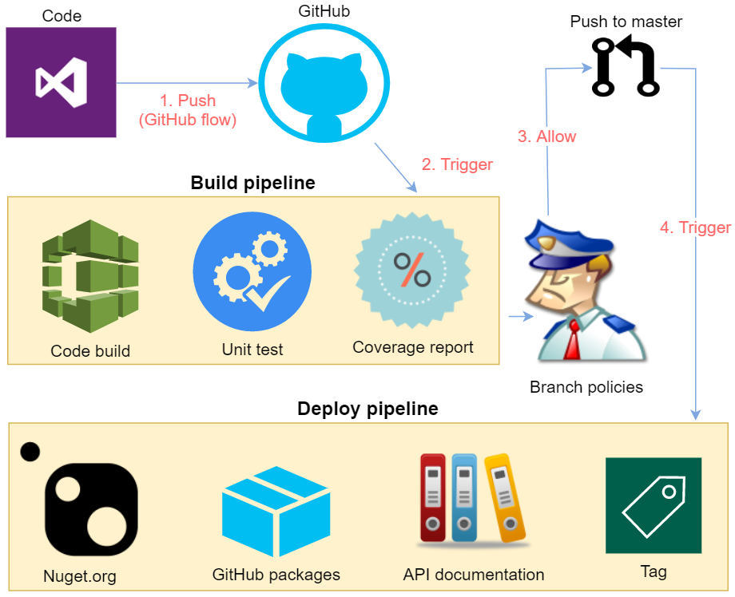

<div align="center" markdown="1">


# .NET Core Services Library
[](https://github.com/celerik/celerik-netcore-services/actions?query=workflow%3Abuild)
[](https://github.com/celerik/celerik-netcore-services/actions?query=workflow%3Adeploy)
[](https://github.com/celerik/celerik-netcore-services/actions?query=workflow%3Adocumentation)
[](https://coveralls.io/github/celerik/celerik-netcore-services)
[](http://www.nuget.org/packages/Celerik.NetCore.Services/)

</div>

## What's it

*Celerik.NetCore.Services* provides a codebaseline for .NET Core service-oriented projects including: base service definition, service argument injection, baseline for services implementing Enity Framework data access and some utilities to configure the service pipeline.

## Quick start

```
PM > Install-Package Celerik.NetCore.Services
```

## API and examples

 - Check out API's documentation [here](https://celerik.github.io/celerik-netcore-services/api/Celerik.NetCore.Services.html).
 - Check out tutorials on Celerik's blog [here](http://celerik.com).
 
## Requirements
  - .NETStandard 2.0
  
## CI/CD pipeline

<div align="center">
    
</div>

## What's next

Check out the road map of *Celerik.NetCore.Services* [here](ROADMAP.md).

## License

*Celerik.NetCore.Services* is licensed under the [MIT license](LICENSE).

## How to contribute
Check out the contributing guide [here](CONTRIBUTING.md).
